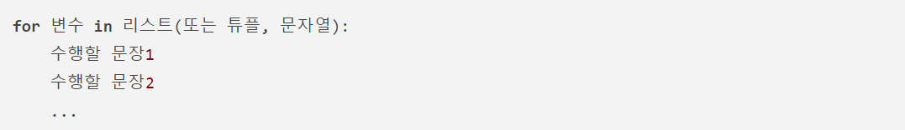
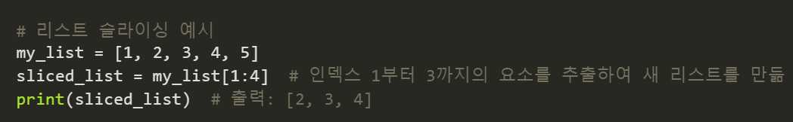

# 파이썬 기본적 개념

## ```변수``` variable
- ```데이터```를 저장 할 수 있음
 
 - 만듦과 동시에 ```데이터```를 할당해야함

## ```배열``` list
- 리스트(list)는 [1, 2, 3] 형태로 정의하며 각 원소를 수정 할 수 있는 특성을 갖음
    - ex) listName = [1,2,3], listName[0] = 1

## ```조건문``` if~else
- 조건의 맞는 값(TRUE)을 인자에 입력하면 실행한다
    - else로 조건에 충족되지 않은 값이 입력되고 실행한다.

## ```while문```
- 조건이 참인동안 실행내용이 반복됨
    - ex) while i > 5 : print('~')

## ```for문```
- 문자열의 첫 번째 요소부터 마지막 요소까지 차례로 변수에 대입되어 "수행할 문장1", "수행할 문장2" 등이 수행된다.
-  
 
 ## ```[:]``` 콜론
 - 매소드의 실행 내용을 정의할 때 콜론을 사용합니다. 콜론 이후에는 들여쓰기를 통해 매소드 내용이 시작됨.

 - 슬라이싱
    - 리스트, 배열등의 일부를 추출할 떄 사용.
    
- ```{}``` Dictionary 키와 value를 구분할 떄 사용.


