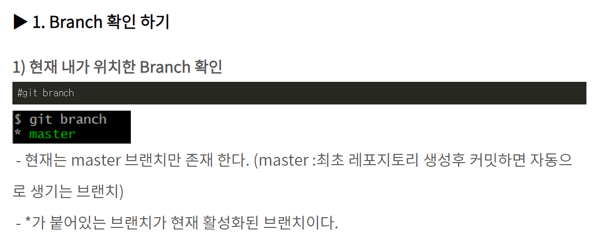
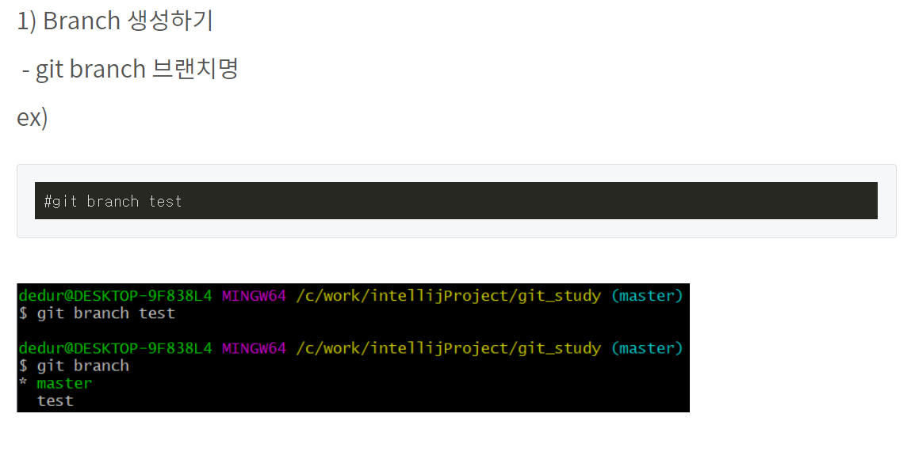
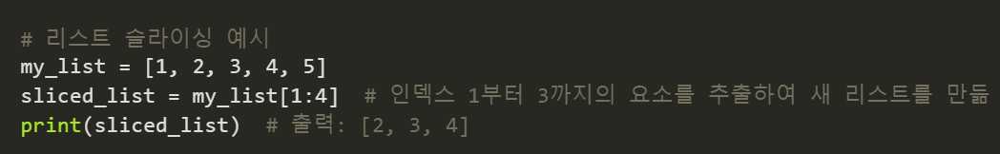

# Today I Learned

오늘 공부한것들 열심히 정리하기. 화이팅
# github 업로드 순서


1. **Working Directory** : 현재 작업중인 파일
    - ```Stage fixes``` : stage의 변경사항을 보냄
2. **Staging Area** : 커밋할 대상을 저장하는곳  ```index```라고도 불림.
    - **```commit```** : 변경된 값을 저장한다.
3. **git directory** : repository 


# Branch란 무엇인가
- 브랜치(Branch)를 통해 하나의 프로젝트를 여러 갈래로 나누어서 관리할 수 있다.

###  ```branch``` 확인


###  ```branch``` 생성하기


## Merge란
- 브랜치를 병합하는 것

# 파이썬 기본적 개념

## ```변수``` variable
- ```데이터```를 저장 할 수 있음
 
 - 만듦과 동시에 ```데이터```를 할당해야함

## ```배열``` list
- 리스트(list)는 [1, 2, 3] 형태로 정의하며 각 원소를 수정 할 수 있는 특성을 갖음
    - ex) listName = [1,2,3], listName[0] = 1

## ```조건문``` if~else
- 조건의 맞는 값(TRUE)을 인자에 입력하면 실행한다
    - else로 조건에 충족되지 않은 값이 입력되고 실행한다.

## ```while문```
- 조건이 참인동안 실행내용이 반복됨
    - ex) while i > 5 : print('~')

## ```for문```
- 문자열의 첫 번째 요소부터 마지막 요소까지 차례로 변수에 대입되어 "수행할 문장1", "수행할 문장2" 등이 수행된다.
-  
 
 ## ```[:]``` 콜론
 - 매소드의 실행 내용을 정의할 때 콜론을 사용합니다. 콜론 이후에는 들여쓰기를 통해 매소드 내용이 시작됨.

 - 슬라이싱
    - 리스트, 배열등의 일부를 추출할 떄 사용.
    
- ```{}``` Dictionary 키와 value를 구분할 떄 사용.

- ```if <조건식>```:
        참인경우 실행하는 코드
- ```elif<조건식>```:
        elif의 조건식이 참인 경우 실행하는 코드
- ```else```:
        거짓인 경우 실행하는 코드

- ## ```조건 표현식``` : valuee if <조건식> els value

- ##  ```while 반복문``` :
    - while 조건식이 참인 경우 반복적으로 코드를 실행  

- ## ```for 반복문``` : 
    - for var in sequence: \
        실행 할 코드
    - sequence 타입의 요소를 순서대로 `var`에 대입하고 모든 요소의 대입이 끝나고 반복문을 빠져나온다.
    - var = sequence[0], var = sequence[1], var = sequence[2], ...

- ##


